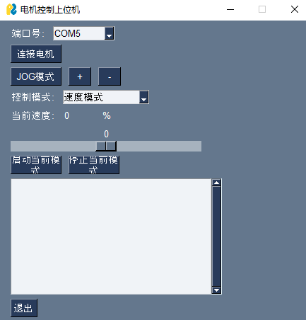

# 灵足电机（RobStride_Motor）USB-CAN通讯及控制模式

## 功能特性

- 支持多种控制模式：
  - 运控模式
  - 位置模式
  - 速度模式
  - 电流模式
  - JOG模式

## 演示示例

- PS5遥控器控制电机运动
- 图形化用户界面（GUI）
- Windows控制程序

## 软件说明

### Motor控制器V1.exe

- 提供直观的电机控制界面
- 支持实时状态监控
- 可进行参数配置和调试

## 开发说明

### 环境要求

- Python 3.8+
- PySimpleGUI
- python-can
- pygame (用于PS5控制器支持)
- pyserial (用于串口通信)

### 安装依赖
